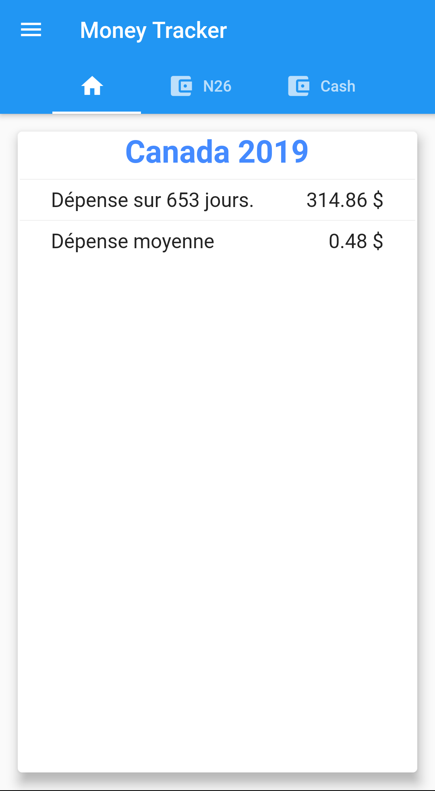
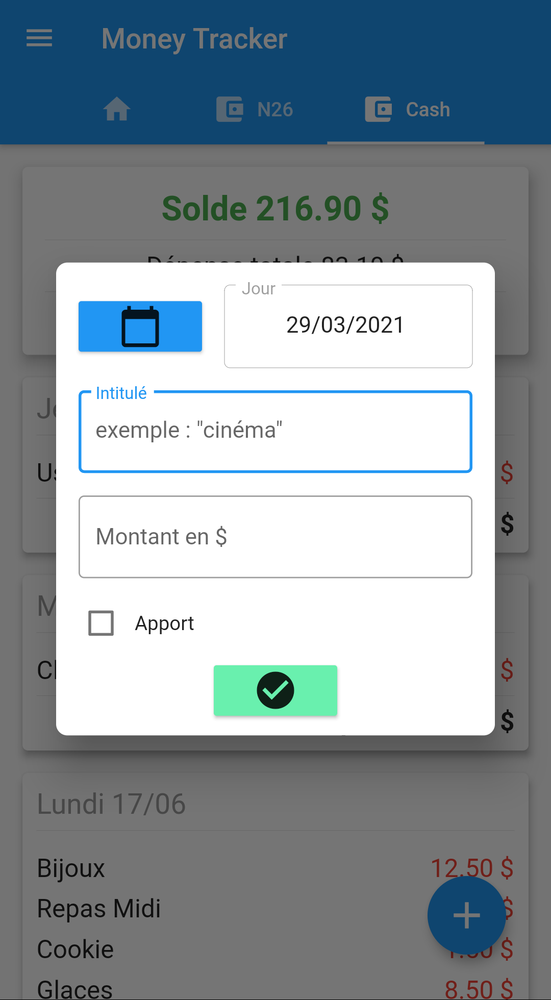
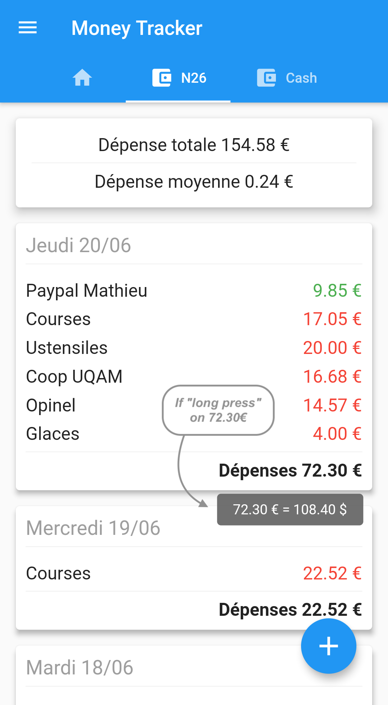

# money_tracker

A new Flutter application to keep track of your budget and expenses during a trip to another country
You can manage multiple wallets, with different currencies !

# Preview

| Creating a trip |
| :---: |
|  |

| Trip summary | First wallet | Second wallet |
|:---:|:---:|:---:|
|  |  |  |

| Adding a new expense/income | Using tooltip to translate currency |
|:---:|:---:|
|  |  |